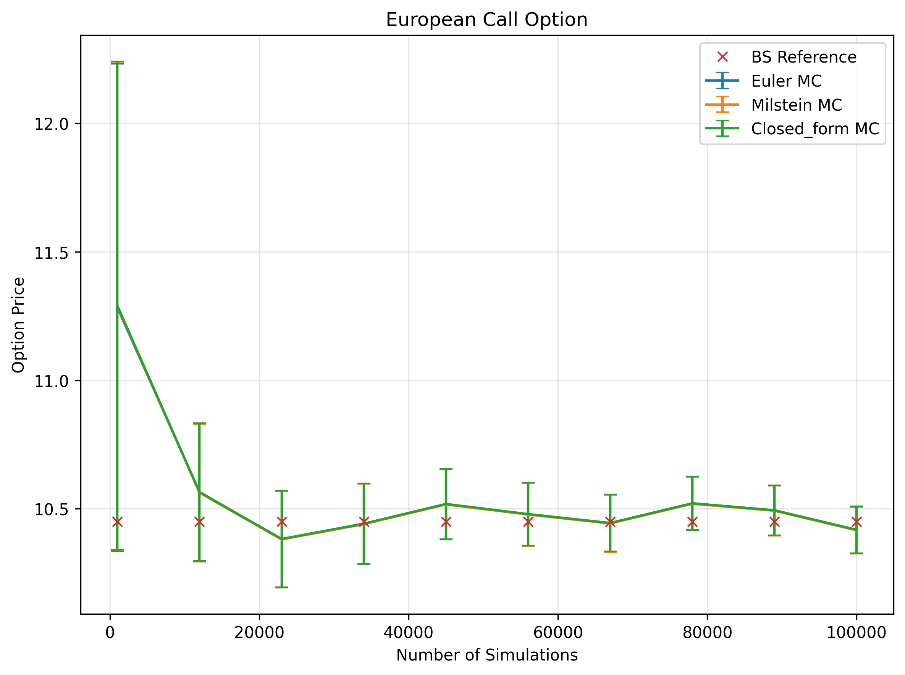

# Option Pricing using Monte Carlo Simulation

📌 Implementation of European & binary option pricing under the risk-neutral measure via Monte Carlo.  
Simulated the underlying asset with three discretization schemes (Euler–Maruyama, Milstein, Closed-form).  
Compared the resulting option prices with each other and with the Black–Scholes closed-form solution,  
and studied sensitivity to simulation parameters.

---

## Project Structure

1. **Introduction to Monte Carlo Methods**  
2. **Simulation Methods for Underlying Stock Price**  
   2.1 Initial parameters  
   2.2 Implementation of Stock Price Simulation Methods  
   2.3 Convergence  
3. **European and Binary Call Options**  
   3.1 Pricing Options  
   3.2 Methods Validation  
4. **Sensitivity Analysis**
   4.1 Analysis Framework
5. **Results**
   5.1 Volatility
   5.2 Risk-free rate
   5.3 Time to expiry
   5.4 Spot price
   5.5 Strike price
   5.6 Number of simulations
   5.7 Number of time steps
6. **Asymptotic Behaviours**
   6.1 Volatility
   6.2 Risk-free rate 
   6.3 Time to expiry
   6.4 Spot and Strike price
7. **Moneyness Analysis**
   7.1 Volatility
   7.2 Risk-free rate 
   7.3 Time to expiry
8. **Conclusions**
9. **References**

## Repo Contents
- `option_pricing_MC.ipynb` – code implementation (no outputs).
- `Outputs/` – key plots from simulations.

## Example Result

## References

- Jäckel, P. (2002) - Monte Carlo Methods in Finance
- https://hautahi.com/sde_simulation
